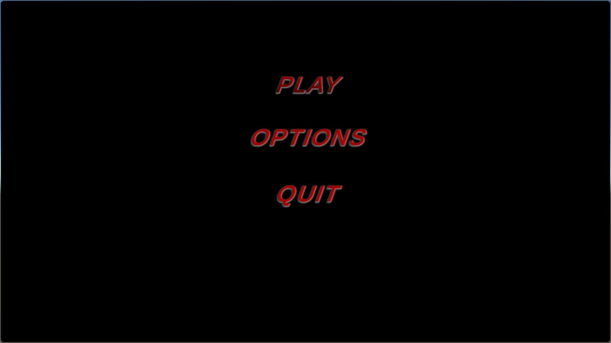
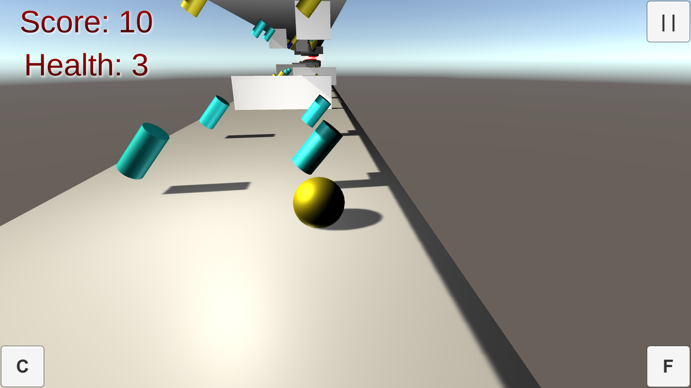
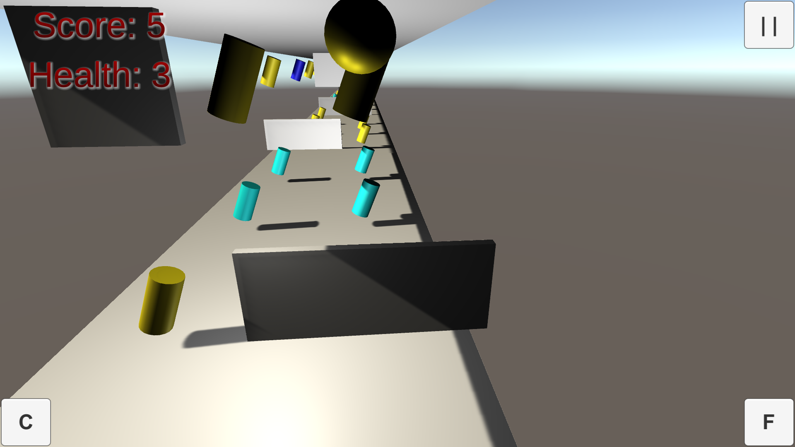

# flip-side-game-with-unity
An Endless runner game with two opposite platforms
In this game, you are required to increase your score by collecting the coins that matches your color in the bottom platform or collect the coins that do not match your color on the top platform. You can collect the health coin that emites light. You can use space key to switch platform and left and right arrows to translate to another lane.

